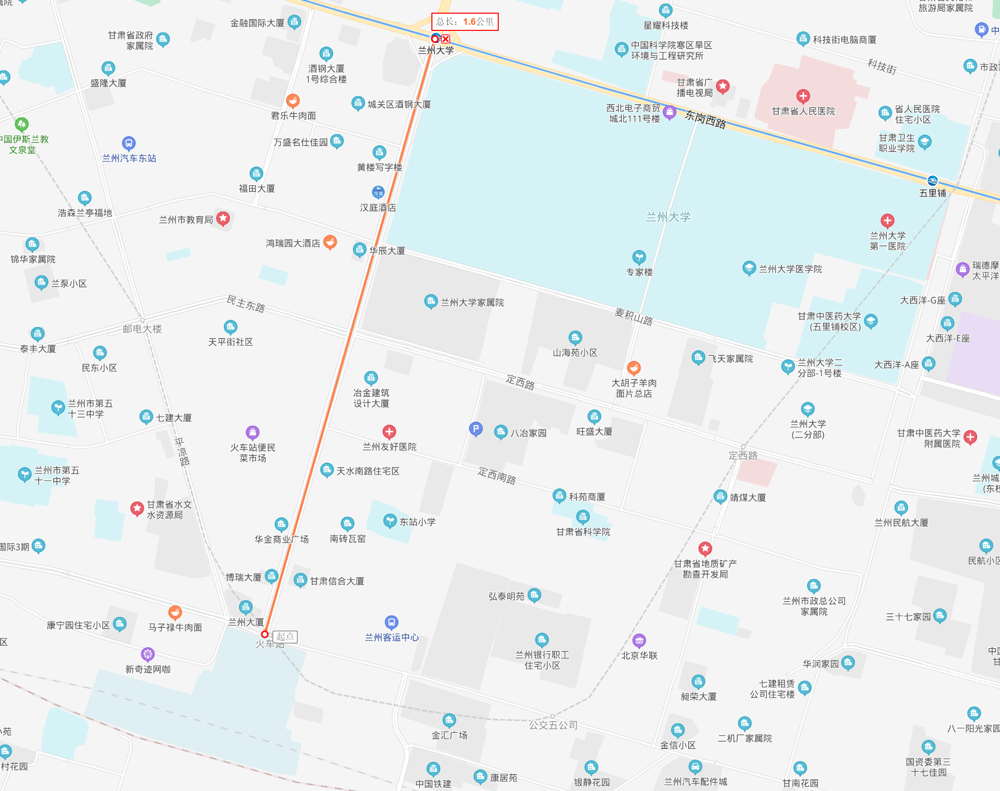
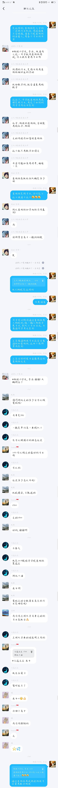
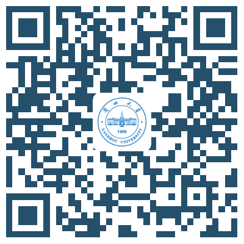

# 20 级物理院萌新大礼包

[TOC]

ver. 2020.08.01

工程 GitHub 地址：[GitHub ver.](https://github.com/AkashiKari/Gifts-for-Freshman-in-School-of-Physical-Science-and-Technology-of-Lanzhou-University)

知乎地址：[Zhihu ver.](https://zhuanlan.zhihu.com/p/163298217)

首先祝贺你，在这特别不容易的一年里，完成了属于你的高考。在接下来的一个月里，你需要将自己的身份从高中生转化为大学生。所以，以下是我（作为秃头学长）的一些建议。

## 学习之外

你们是在**榆中校区**学习的，而不是在盘旋路本部，这一点一定要有心理准备。乘校车过来的途中，你会穿过两次黄河，三条隧道，爬升将近 200m（从兰州市区）。说到这儿，顺便提一句，榆中“位于泰山之巅”，**海拔约 1700m**，所以在运动时格外要注意自己的感受，实在撑不住了就不要运动了，休息一会儿。

在健康管理方面，我建议你自行购买**常用药品**，例如布洛芬、对乙酰氨基酚、创可贴、清凉贴等。不是我黑兰大，校医院是真的 emmm 一言难尽。

兰州由于地处西北的黄土高原，一个优势在于，夏天只要站在树荫底下就很凉快，你会希望太阳早点下班的时候也只有军训的二十几天了。对了，听说你们这一级是真的把军人拉来当教官的，所以可能训练会比较辛苦（因为 19 级的教官是最后一届国防生，对学弟学妹肯定还是有一些照顾）。军训的时候记得**存一点干粮**，免得到时候训练到没时间吃饭。

尽管我们自己将“兰大”自黑为“夏大”（夏官营大学，因为榆中校区在兰州市的榆中县的夏官营镇的吴谢营村），但是校内生活设施保障还是 OK 的。综合楼建起来了，校内还有多个天猫超市，还有三个学生食堂，新宿舍是上床下桌的，也挺不错（当然，得看具体分到哪栋楼，不是新楼的话可能还是一边床一边桌）。生活用品和吃饭问题基本都能够在校内完成。网购也不成问题，记得地址是“**甘肃省兰州市榆中县夏官营镇兰州大学榆中校区**”哟。此外，现在是快递统一收到校内来，邮政是直接送到北区浴室旁的中国邮政，其他的快递（除了百世）都是直接送到南区浴室的菜鸟驿站处（顺丰在同一栋建筑的一间小屋子里【这么说可能很抽象，到时候你实际过来看看就懂了】，京东送到菜鸟驿站的隔壁）；百世有点特殊，你得去点点达上面要求他送进来（无力吐槽）。

现在，在疫情防控的情势下，十分不建议出校，因为**只要出校（包括去城关校区）就要请假**，而 lzu 的请假又很麻烦（记得销假），所以能少出去就少出去吧。然后，进校了之后，会一日三报体温，以及晚点名，这两件事不要忘了，因为直接和综测挂钩，综测和奖学金评选啥的挂钩。

不要过分担心饮食吃不惯的问题。可能兰大的确没有热干面、豆皮、糊汤粉什么的，但是水果、蔬菜、米、面都有。（当然，吃遍了以后还会纠结“早上吃什么呢”“中午吃什么呢”“晚上吃什么呢”——此之谓“吾日三省吾身”也。）

生活习惯方面，我们宿舍**周日到周四都是 23:00 熄灯断电，周五周六是 24:00 熄灯断电**。早上都是 6:00 来电。因为会熄灯，如果你比较习惯于晚睡，就一定要准备可充电的灯。有光是刚需。而且手机晚上因为断电也是充不进电的，要提前准备。

大学里面社团有很多，在不影响学业的情况下酌情参加。

<!-- 需要添加的内容：交通指南 -->

## 交通指南

兰州大学的盘旋路校区（通常称为本部或者城关校区）、医学校区和榆中校区之间有校内通勤车，具体情况可以关注公众号【[兰小 e](https://mp.weixin.qq.com/s/z_APonuTp38wAZVbN38XGg)】【兰州大学】搜索“校车”查询，或者下载 app【[兰朵儿](https://ldr.cool/)】【兰州大学】。（二者都可以扫描文末二维码下载哦。）

这里的交通指南关注的是兰州市内各旅客集散站点到兰州大学城关校区的交通方式。在新生入学时，学校会有特殊安排，记得及时 check 上面的公众号哦。这里介绍的是其他时候的交通方式，仅供参考！

兰州站到校本部是最方便的，因为兰州站就在天水南路的南部尽头，而兰州大学城关校区就在天水南路与东岗西路的十字路口。距离仅 1.6km。

如果你实在不想走路，可以在兰州站广场东侧的**兰州车站**公交站乘 1 路、131 路，或者在天水南路的**兰州车站**公交站乘 10 路、16 路、110 路至**兰州大学**公交站下车。

兰州西站到校本部的最便捷方式是乘坐轨道交通 1 号线从**兰州西站**地铁站坐到**兰州大学**地铁站，通过 D 出口出站，再向南走大约 70m 就可以到兰大西门了。

中川机场到校本部最便捷方式是乘坐**机场巴士一号线/机场巴士/机场巴士城关区线**到**兰州东方大酒店**下车，过马路就是兰大的校本部了。（去中川机场要稍微复杂一点，善用度娘哦。）

## 关于学习

### 课内学习

推荐[18 级的田西城大佬](https://www.zhihu.com/people/tian-xi-cheng)在知乎上写的这篇文章：[兰州大学（LZU）物理学院的物理&数学课丨 2018&2019 级（持续更新）](https://zhuanlan.zhihu.com/p/111637186).

首先，相信我，你在假期里学习的效率会小于在学期中学习的效率（当然，效率最高的时候是在考试之前）。所以**不要妄想在暑假里预习完大一上学期的所有课程**。但是，还是建议提前了解了解学习的内容，比如大一上会学的高等数学（上）、线性代数 I、计算物理 I（= C 语言）、力学基础 I、热学基础 I。

高数我们学校物理类用的是本校数学系张志强副教授（人称“强哥”）编的、兰州大学出版社出版的《高等数学》，网上似乎很少卖（群文件里有上下册的课本与答案，值得注意的是，答案有一些错）。说真的，强哥的教材作为习题集是很好的，但是作为（自学的）教材，我觉得有些地方讲得不明不白的。作为这里推荐参考北京大学出版社出版的《高等数学（第二版）》（李忠、周建莹编著）。但是，期末考试之前要努力复（yu4）习强哥的教材。顺便说一句，考前强哥会划重点，而且划得很准。不管你选没选强哥的课，一**定要想办法得到强哥划的重点**。还有一点一定要说，我们学的数学和数学系的是不一样的！！不要想着我把他们的数学分析教材拿过来全刷一遍，我的高数成绩就鹤立鸡群了。因为我们的高数主要还是在于计算积分。而对数学系而言，他们需要会证积分的收敛性什么的，而这对物理系而言只是徒增负担。因此，不管看什么数学书，对于学物理的学生而言，首选物理人写的数学书，书看起来就不会那么痛苦。高数是数学院开的，所以不分大班、中班，也没有小班。对于考试的话，你们也应该会有高数的月考，考试之前稍稍准备一下就可以，重头戏还是期末考试。期末考试题量并不是很大，尽管考试时间是 2h，但是 1h30min 绰绰有余。推荐的网课有上海交通大学乐经良的、北京大学彭立中的。

我们线性代数 I 的教材是 David C. Lay 的《线性代数及其应用(_Linear Algebra and Its Applications_)》。这个教材很通俗易懂，并不繁难。不过呢，还是推荐先看看 B 站上的 3Blue1Brown 的《线性代数的本质》，先不要去纠结具体的算法，要去了解概念为什么会提出来，和前后的概念有什么关系。反正在学期中会大量做矩阵、行列式等的计算。线性代数是很优美的学科，其实也很好上手，而且也很重要。如果想了解量子理论，线性代数是一个不错的突破口。此外，在学习线性代数的过程中，可以考虑和编程结合结合，比如使用 Matlab 啊、Python 啊。Matlab 的线性代数运算特别快（可以帮助你处理作业——这句划掉），Python 的优势在于它是通用编程语言，而且 numpy、scipy 等都可以进行线性代数运算，而且 seaborn 画图比 Matlab 更好看。人生苦短，我用 Python。副院长说：“Python 简单得像个 1 一样。”回到线性代数。我们学院为了简化课程，不讲其中第四章向量空间，但是向量空间才是线性代数精华中的精华，矩阵计算只是“技”，而线性空间的性质却是“道”。尽管说只有“道”没有“技”是不行的，但是只有“技”也是不行的。关于向量空间，推荐看大名鼎鼎的《线性代数应该这样学(_Linear Algebra Done Right_)》，这本书是一个新的高度，虽然初看的确很难看懂。但是，学物理就要有不怕困难、刻苦钻研的精神。在上课方面，19 级的安排是 Dietz Babara 老师上大班课（每两个星期一大节）（没错，是德国的老师），陆汉涛等老师上中班课（每周一大节），课后还有小班课（每周都有，具体长度按照小班学长学姐的安排）。真的，无论你被分到那个中班，都建议去听听陆汉涛老师的中班课，真的是一种美的享受。关于考试，19 级是既有期中考试又有期末考试的，而且**期末考试题量比较大**。做好准备。推荐的网课是 MIT 18.06。

计算物理 I 主要是写**C 语言**，当然还会了解一些 Linux 的命令行操作。在假期里，C 语言了解多少都无所谓，而且最最关键的是要自己写程序！！！编辑器建议使用 Visual Studio Code（巨硬是真的良心），以后想要写 Python、Markdown、LaTeX 啥的，他都能干。当然要想程序能够运行，首先你要配置一下编译环境，用 gcc 也好，用其他的 IDE 也好，网上教程很多的。我们的教材是北京大学裘宗燕的《从问题到程序——程序设计与 C 语言引论》。但是**这本书真的太烂了**，而且好多程序还跟不上时代。C 语言推荐的书籍是 **_C Primer Plus_**（不是 C++ Primer Plus 哦），有能力者看英文版，相应的中文版也有，配合自己的能力选择。记住，学习 C 语言，就是要**多写程序！多写程序！多写程序！多跑程序！多跑程序！多跑程序！**

力学基础 I，罗洪刚院长带大班（隔周一大节），中班会有魏少文等三位老师带（有大班的周是一大节，没大班的周是两大节），每周都有小班。这个课，要做好心理准备，毕竟我们是独树一帜的物理院，19 级大班讲了欧拉-拉格朗日方程，以至于中班连刚体都没讲完……**真正要基础扎实的还是得靠自己**，力学基础 I 和下面的热学基础 I 都是这样的。不然一天别人问你：“你学了这么多门物理课，你擅长其中的哪一门？”你支支吾吾半天回答不上来。考试方面，有月考，有期末考，不过 Level I 的课程，特别是大一上的这两门课，不用太担心，考试的时候有正常人的智商的话就肯定能过。还是要注意思维方式的转变。（在力学基础 I 上显示的不明显，套用高中的思路也能取得好成绩，但是热学基础 I 要特别注意转变思路。）教材方面，按道理而言是没有指定教材的，罗院长推荐了这么一些书：John R. Taylor 的 Classical Mechanics，赵亚溥的《力学讲义》。但是这些教材真的太“高”了，还是要看看真正普通物理力学的书，比如舒幼生的《力学》、赵凯华的《新概念物理·力学》。推荐的网课有北京大学舒幼生的、北京大学田光善的。

热学基础 I，可能是大一上的一个拦路虎，很多同学都说热学没学明白（包括我，所以这个暑假我打算复(yu4)习），因为这门课有**成堆的公式**要推导，然后你推导完了之后感觉串不起来（这是我的真实想法，可能是我太菜了）。要不是在高中我学过 3-3，我估计自己难以苟下来 ╮(╯▽╰)╭ 所以这门课一定要转变思路：**理解优先！理解优先！理解优先！**要是你在学完之后能够感觉热学的体系挺清晰的，大概的细节也能回忆出来，你就可以超过至少 80%同学了。关于教材，中班老师用的是李椿的《热学》，罗院长推荐的有 Claus Borgnakke, Richard E. Sonntag 的 _Fundamentals of Thermodynamics_。不过这本英文教材热力学讲得特别硬核，远超普物要求的热力学。国内的书估计也就王竹溪的《热力学》或者化学系的物理化学会讲这么深吧。个人推荐 Herbert B. Callen 的*Thermodynamics and an Introduction to Thermostatistics*，群文件里有它的部分中译，THU 物院在用（他们只做前 9 章的要求）。这本书的观点也很高，完全抛开了热力学零、一、二、三定律，从熵表象入手，能接受的人会觉得很劲爆。课程安排方面，同力学 I 一样，罗洪刚院长带大班（隔周一大节），中班会有蔡让岐等三位老师带（有大班的周是一大节，没大班的周是两大节），每周都有小班。考试方面，会有期中考试（可能会有一点小难），但是期末考试不用太担心，因为是老罗出题（不要问为什么，问就是一以贯之）。

英语不要落下。你们军训期间会有英语分级考，考得怎样就决定你进哪个等级英语班，19 级是 75 分以上进 E 级，18 级好像是 80 分以上进 E 级。分级考主要考的是听力和阅读。听力和四六级类似，**只有选项在卷子上，题干靠听**。此外，**过四级（就是四级 425 分以上）是拿到学位证的必备条件**，六级是研究生的入门关。大一上似乎只有 A 级是不让考四级的，其他级别都能考。学长的建议是：能尽早考就尽早考，早死早超生。提一句，大三的时候还没过四级的，会被强制修“英语测试”这门课，就是为了让你过四级。四级分数分布是：满分 710 分，听力 250 分，阅读 250 分，汉译英 105 分，写作 105 分。题量可以自行搜索参考。

大学有思政课，大一上上的是《思想道德修养与法律基础》，简称思修。emmm 这方面我真的也没什么经验，因为我也只求思政课**不要太给 GPA 拉后腿**。

体育课只有大一大二上。在军训期间，你们会要求选课，选的是体育和英语。英语上面说了，关于体育课——一定要**尽早**选！一定要**尽早**选！否则有可能像我的室友，只能选排舞了。（排舞排舞，排成一排跳舞，你能想象这对一个没有任何舞蹈经验的男生有多么困难。）大学四年有很重要的项目叫作**体测**。体测至少有这么几项（男生的情况）：1000m 跑（及格是 4'05"）、立定跳远（226cm 及格）、引体向上（4 个及格）。

选修课不要瞎选，**万一挂了可能就会失去一些机会**。

在课内学习这部分的最后，我想说：一定要重视期末考试、GPA，不能作弊，也别听什么“没有挂科的大学是不完整的大学”，真正需要 GPA 的时候你会哭的。

对了，从 19 级开始挂科直接重修。一学年落下 15 学分（就是考挂了 15 学分）直接留级，落下 20 学分就劝退了。

### 课外学习

这里主要说一说假期里面最好做的准备、要学的技能。

**电脑是刚需**。不建议使用台式机。电脑上最好提前安装好 Matlab、Visual Studio Code（也就是 VS Code）、Python 及一些常用的包（或者 Anaconda）、TeX Live，并且配置好 Python 和 VS Code。学学 LaTeX 的排版，学学 Markdown。

Python 必须安装的包有：numpy+mkl, scipy, pandas, seaborn。（如过选用 Anaconda 的话，它就会自带这些包。）VS Code 的配置主要集中在 Python 的运行环境、Markdown、LaTeX 的配置这么几个方面，我相信你善用搜索引擎可以很好完成这些工作的！【Tip: 可以在百度里这样搜“vscode python 配置”“vscode markdown”“vscode LaTeX 配置”】

在 Windows 上，VS Code 配合 gcc 使用的方法在[这里](https://zhuanlan.zhihu.com/p/147366852)哦。

可以尝试参加一些竞赛。比如说，大一下完了之后兰大校内会进行数学建模竞赛的选拔，如果你有志于数学建模竞赛，可以考虑看起数学建模的书与论文了。但是，这些要在不影响你课内学习的情况下进行哦。

## 几点建议

1. 除非你想收藏教材，你可以买新教材，只是作为学习用途的话，你可以去**校园里面卖二手书的书店买教材**。如果你要进行无纸化学习的话，要去找 pdf 资源，可以自行去知乎搜索找电子版教材的方法。
2. 电脑相对而言更刚需，**资金有限的情况下先买电脑**，之后再买 iPad 啥的。还有，外接一个大屏幕挺好的。
3. 一定记得准备一个**科学计算器**。有些课的期末考试的时候肯定需要计算器，比如概率论与数理统计。卡西欧的 fx-991cnx 这种就可以了。然后学习如何用科学计算器进行统计计算。
4. 大学的学习和中学不一样，不要在一本书上吊死。**多参考几本教材**，甚至是英文教材，你这样会找到你为什么学不下去指定教材的原因了 ╮(╯▽╰)╭
5. 在电脑上安装 kiwix，并下载一些离线的 wikpedia 的数据包。建议中文+英文，因为中文版的维基百科缺的词条还有点多，英文版的比较全，而且可以训练学科英语的阅读。
6. 暑假期间可以学学车，但是想要在这个月的时间内拿到驾照还是比较困难的。如果没拿到，在上学期间可以玩玩欧卡 2（这是私货）。
7. 结识一些学长学姐。当你遇到困难的时候，抱大腿不失为一些方法，而且你也会了解一些你不知道的信息，因此可能获得更多的机会。
8. 了解学校里面一些**优秀的学院、班型**什么的，比如说珠峰计划、严济慈班、一士班、黄昆班什么的。有意的话可以提早准备。（这个时候可以好好“利用”学长学姐。）
9. **手机内存不能太小**。学校会使用一些奇奇怪怪的软件，然后会要求做一些奇奇怪怪的事。手机储存容量小了根本吃不消。
10. 下载兰朵儿 app！这是物理院学长写的，真的特别好用！真的是你在兰大生活的好帮手。有了它，你就不怕上课迟到、不知道进哪个教室了。而且，还可以做安全微课、查成绩等等，很方便的。

## Q&A

1. > "我们的教材是北京大学裘宗燕的《从问题到程序——程序设计与 C 语言引论》。但是这本书真的太烂了，而且好多程序还跟不上时代"

Q: 不敢苟同，个人觉得还是很好的一本书。
A: 我持保留意见。不过这本书在物理院的风评确实很差。

2. Q: 请问你们要女孩子嘛?
   A: 当然要了！想想 7:1 的男女比，就“哇——”的一声哭了出来|ω・）文中的体测标准都是男生的，关于女生的标准可以加 QQ 群 1048781439，里面会有学姐来解答哦。
   

3. Q: 男女比真的这么低吗？
   A: 大一进来一个班快 70 号人，其中只有七八个女生（物理类是这样）。材料类的话强一点，八九十号人，其中有十几二十个女生。这是 19 级的情况。【所以少年，找女朋友要趁早啊】

4. Q: 有分班考试吗？
   A: 行政班是没有的。英语班会有分级考试（按照校历安排在了**9 月 19 日**）。

5. Q: 我高中的时候很喜欢物理但是我害怕大学就学不明白了。
   A: 有热爱就去尝试，即使尝试发现走不下去了也不要紧，毕竟物理退路还是很多的。

6. Q: 我如果报考物理系会不会参考我的物理成绩呀？
   A: 在平行志愿下是不参考的。反正高中是过去时了，很多牛人也都是在大学里面从一张白纸学起的。

7. Q: 开学的基地班考试是啥？
   A: 

8. Q: 翠英学院是怎样的培养机制呢？
   A: 翠英学院的官网在[这里](http://cycollege.lzu.edu.cn/index.htm)。具体到 2019 级的考核标准，在[这里](http://cycollege.lzu.edu.cn/info/1048/4474.htm)。特别地，对于物理萃英班，2018 级开始实行 2+2 体制，前两年和物理院物理学专业在榆中上一样的课，后两年搬到校本部，但是培养方案还在制订当中，目前还没有 PDF 版给我们。会开的课程和物院一样，但是毕业要求修哪些课和物院不太一样，荣誉学位有额外的要求。

9. Q: 几个公众号和 app 的二维码呢？
   A: 下面是公众号【兰小 e】——
   

   下面是公众号【兰州大学】——
   

   下面是**Android 版**的 app【兰州大学】下载地址——
   

   下面是**iOS 版**的 app【兰州大学】下载地址——
   

   下面是 app【兰朵儿】下载地址（**仅限 Android 用户**）——
   
